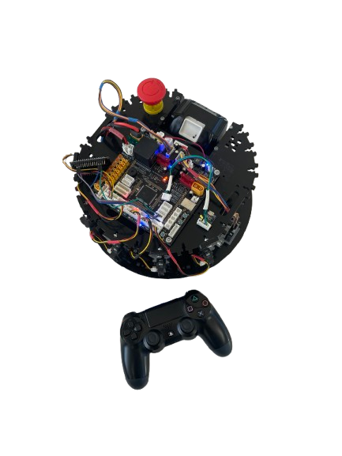

# Obstacle Avoiding Robot
## Project Overview

The Obstacle Avoiding Robot is an autonomous robotics project designed to navigate efficiently through environments by detecting and avoiding obstacles. Developed as part of a second-year project in BUT GEII (Electrical Engineering and Industrial Computing).

 

  <figure>
    
    
<em>Overview of the Obstacle Avoiding Robot</em>

  </figure>

 

## Project Objectives

1. **Design an autonomous mobile robot** capable of detecting and avoiding obstacles in real-time
2. **Implement intelligent navigation algorithms** adapted to different environments and situations
3. **Develop a graphical control interface** to visualize sensor data and send commands to the robot
4. **Establish reliable Bluetooth communication** between the robot and the control interface
5. **Integrate a manual control system** via a compatible controller or Bluetooth device

## Hardware Specifications

The robot is built around the following components:

- **Microcontroller**: PIC used for central processing and decision making
- **Distance Sensors**: Infrared sensors for obstacle detection
- **Bluetooth Module**: ESP32 configured in slave mode for wireless communication
- **Locomotion System**: DC motors with encoders for precise control
- **Power Supply**: Rechargeable batteries offering several hours of autonomy

## Robot Programming

The robot is programmed using the MPLAB environment in C++ for the robot and the Visual Studio environment in C# for the control interface:

The programming is low-level, directly utilizing the microcontroller's registers to configure various modules such as analog-to-digital converters (ADC), digital-to-analog converters (DAC), choppers for PWM motor control, and other peripherals.

The program uses advanced structures to optimize execution speed and memory usage:

- Circular buffers for efficient sensor data processing
- Multi-level timers for precise task management
- Optimized data structures for fast information storage and access

### Software Architecture

The source code is structured into several distinct modules that interact with each other:

#### Detection Module
- Management of infrared sensors
- Signal filtering and processing to eliminate noise
- Distance calculation and obstacle identification
- Simple mapping of the immediate environment

#### Locomotion Module
- Precise motor control via PWM
- Encoder management for position tracking
- Progressive deceleration and acceleration algorithms
- Differential control for precise turns

#### Decision Module
- Obstacle avoidance algorithms
- Short-term path planning
- Priority systems for decision making

#### Communication Module
- Bluetooth protocol for remote control
- Management of incoming commands
- Sending telemetry data
- Flow control system to prevent saturation

## C# Control Interface via Bluetooth

The robot can be controlled and monitored using a Windows application developed in C#:

- **Real-time Control**: Manual piloting of the robot via directional commands with immediate visual feedback
- **Sensor Data Visualization**: Graphical display of measured distances and environment representation
- **Autonomous Behavior Configuration**: Adjustment of detection thresholds
- **Automatic/Manual Mode**: Easy switching between robot operating modes

### Bluetooth Communication

The system uses an ESP32 configured in slave mode to establish a wireless serial connection with the computer. The communication protocol includes:

- Movement commands (forward, backward, turn right/left, stop)
- Sensor status requests (distances, speed)
- Configuration commands (adjustment of thresholds, speeds, modes)
- Support for control via a game controller (such as a PS4 controller)

---

© 2024 Obstacle Avoiding Robot. Developed by Bosco.